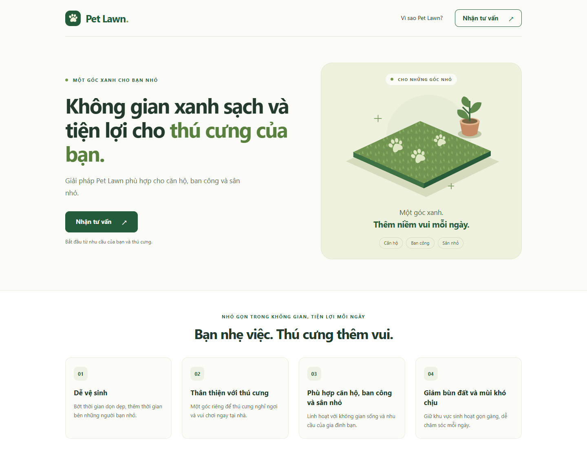
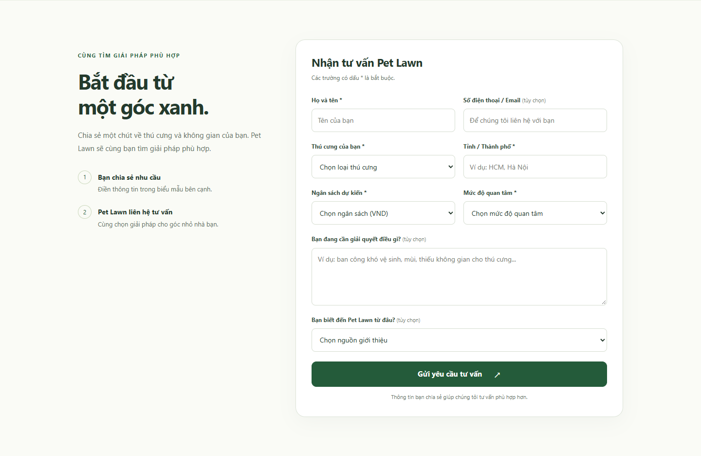
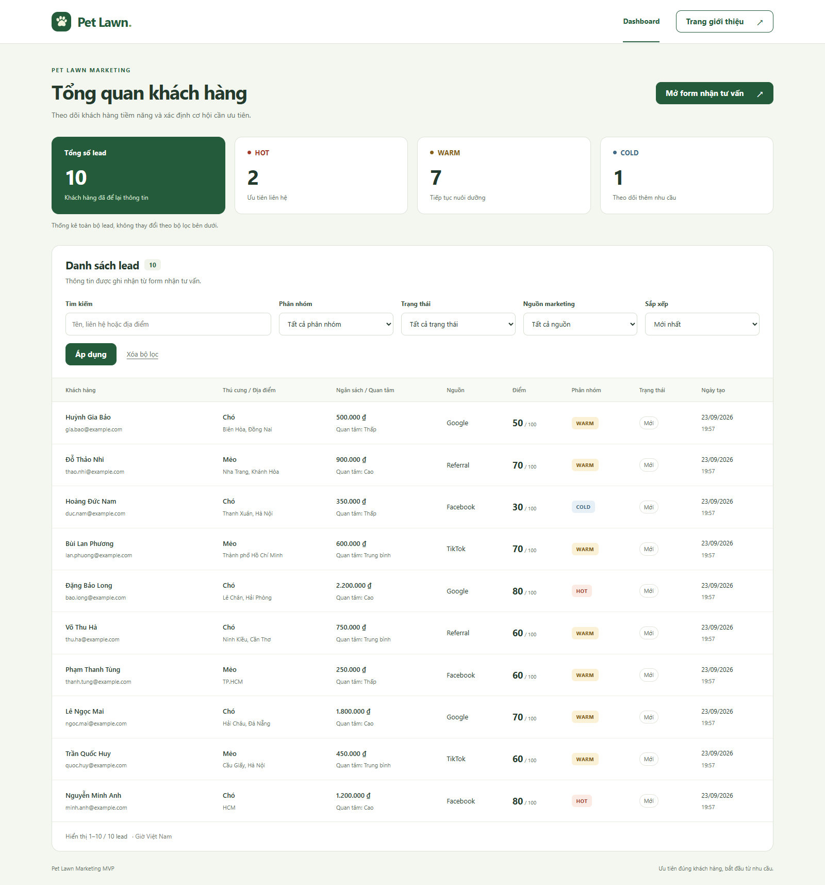
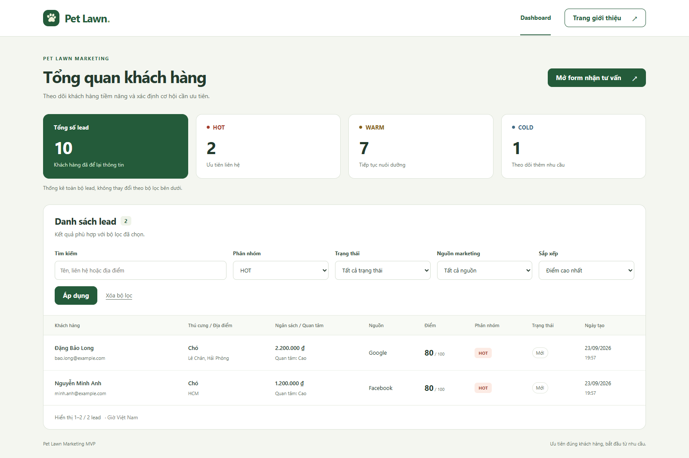

# Pet Lawn Marketing MVP

**Từ khách truy cập đến danh sách khách hàng tiềm năng có thứ tự ưu tiên.**

MVP cho một chiến dịch marketing sản phẩm Pet Lawn — giải pháp thảm cỏ cho
thú cưng tại căn hộ, ban công và sân nhỏ. Khách hàng gửi nhu cầu qua landing
page; hệ thống lưu thông tin, tự chấm điểm theo quy tắc và hiển thị trên dashboard
để đội marketing xác định khách hàng cần liên hệ trước.

**Laravel 12 · PHP 8.4 · MySQL 8.4 · Blade · JavaScript · Vite · Docker Compose**

> Dự án chạy cục bộ bằng Docker, chưa có bản deploy công khai.
> Xem giao diện trong phần ảnh demo bên dưới hoặc làm theo hướng dẫn để chạy thử.

## Ảnh demo

Ảnh chụp từ ứng dụng chạy tại localhost. Thông tin khách hàng trong dashboard
là dữ liệu mẫu; các địa chỉ email dùng miền `example.com`.
Nhấn vào ảnh để xem kích thước đầy đủ.

### 1. Landing page

Giới thiệu sản phẩm, lợi ích và lời kêu gọi nhận tư vấn bằng tiếng Việt.

[](docs/images/landing-page.png)

### 2. Form tiếp nhận khách hàng

Thu thập nhu cầu, ngân sách, địa điểm và mức độ quan tâm. Dữ liệu được kiểm tra
phía server; sau khi lưu thành công, khách hàng nhận thông báo cảm ơn.

[](docs/images/lead-form.png)

### 3. Dashboard marketing

Thống kê toàn bộ lead, hiển thị thông tin liên hệ, điểm, phân nhóm và trạng thái.
Bộ dữ liệu mẫu gồm **10 lead: 2 HOT, 7 WARM và 1 COLD**.

[](docs/images/dashboard.png)

### 4. Lọc khách hàng cần ưu tiên

Ví dụ lọc nhóm HOT và sắp xếp theo điểm cao nhất. Danh sách còn 2 lead;
các ô thống kê vẫn thể hiện toàn bộ 10 lead.

[](docs/images/dashboard-hot.png)

## Chức năng đã hoàn thành

| Chức năng | Hành vi |
| --- | --- |
| Landing page | Giao diện tiếng Việt, responsive, giới thiệu sản phẩm và form tư vấn |
| Lead capture | Validation, CSRF, giữ dữ liệu khi có lỗi, thông báo sau khi lưu |
| Lưu trữ | MySQL, model Lead, migration và 10 bản ghi mẫu |
| Chấm điểm tự động | Tính điểm từ ngân sách, mức quan tâm, nhu cầu và địa điểm |
| Phân nhóm | HOT / WARM / COLD theo ngưỡng điểm rõ ràng |
| Dashboard | Tổng số lead và số lượng từng phân nhóm |
| Tìm kiếm / lọc | Tên, liên hệ, địa điểm; lọc phân nhóm, trạng thái, nguồn marketing |
| Sắp xếp / phân trang | Mới nhất hoặc điểm cao nhất; 10 lead/trang, giữ bộ lọc |

Phạm vi hiện tại hoàn thành **bước 1–5**. Trang chi tiết lead và cập nhật trạng
thái là phần phát triển tiếp theo. Chưa triển khai AI, machine learning,
đăng nhập hoặc REST API.

## Luồng hoạt động

```text
Landing page → Form nhận tư vấn → Validation → LeadScoringService
                                             ↓
                                       Lưu lead vào MySQL
                                             ↓
                                  Dashboard → Tìm kiếm / Lọc
```

`LeadController` chỉ nhận dữ liệu đã qua validation. Event `creating` của
model Lead gọi `LeadScoringService` trước khi insert, nên lead mới được lưu
cùng điểm và phân nhóm. Service chỉ tính toán, không ghi database; dashboard
đọc kết quả đã lưu. Công thức không lặp lại trong controller hoặc seeder.

## Quy tắc chấm điểm

| Đặc điểm | Điều kiện | Điểm |
| --- | --- | ---: |
| Ngân sách | ≥ 5.000.000 VND / 2.000.000–4.999.999 VND / < 2.000.000 VND | 30 / 20 / 10 |
| Mức quan tâm | high / medium / low | 30 / 20 / 10 |
| Nhu cầu (pain point) | Có nội dung / rỗng | 20 / 0 |
| Địa điểm | Thuộc danh sách TP.HCM / địa điểm khác | 20 / 10 |

Tổng điểm từ **30 đến 100**: **HOT ≥ 80**, **WARM từ 50 đến 79**, **COLD < 50**.
Ví dụ: ngân sách 5 triệu + quan tâm cao + có nhu cầu + HCM
= **30 + 30 + 20 + 20 = 100 → HOT**.

Địa điểm được trim và so sánh không phân biệt hoa thường với `HCM`,
`Ho Chi Minh`, `Ho Chi Minh City`, `TP.HCM`, `TP HCM`, `Thành phố Hồ Chí Minh`.
Chuỗi địa chỉ dài hơn không tự động được suy đoán là TP.HCM.

Rule-based scoring phù hợp giai đoạn MVP vì chưa có dữ liệu chuyển đổi lịch sử,
dễ kiểm thử và giải thích từng tiêu chí. Điểm thể hiện mức ưu tiên theo quy tắc,
chưa phải xác suất mua hàng. Sau này có thể dùng dữ liệu chuyển đổi để đánh giá
và cải tiến phương pháp chấm điểm.

## Công nghệ

| Thành phần | Công nghệ |
| --- | --- |
| Backend | Laravel 12, PHP 8.4 trong Docker; mã nguồn yêu cầu PHP 8.2+ |
| Database | MySQL 8.4, Eloquent ORM và migrations |
| Frontend | Blade, CSS responsive, JavaScript thuần |
| Build assets | Laravel Vite, Node.js và npm |
| Môi trường | Docker Compose: một container app và một container MySQL |
| Kiểm thử | PHPUnit, Laravel Feature Tests; SQLite in-memory cho test |
| Coding style | Laravel Pint |

## Chạy dự án trên máy

### Yêu cầu

- Docker Desktop đang chạy với Linux containers.
- Node.js 22.12+ hoặc 24 và npm.
- Git nếu lấy mã nguồn bằng clone.

PHP, Composer và MySQL chạy trong Docker; không cần AMPPS hoặc PHP trên Windows.

### Cài đặt lần đầu

Mở PowerShell **tại thư mục chứa `compose.yaml` và `artisan`**.

**1. Tạo file môi trường nếu chưa có:**

```powershell
if (!(Test-Path .env)) { Copy-Item .env.example .env }
```

**2. Điền cấu hình database trong `.env`:**

| Biến | Cấu hình |
| --- | --- |
| `DB_CONNECTION` | `mysql` |
| `DB_HOST` | `mysql` — tên service trong Docker Compose |
| `DB_PORT` | `3306` |
| `DB_DATABASE` | Tên database riêng, ví dụ `pet_lawn_marketing` |
| `DB_USERNAME` | Tài khoản ứng dụng riêng, ví dụ `pet_lawn` |
| `DB_PASSWORD` | Tự đặt mật khẩu cho tài khoản ứng dụng |
| `DB_ROOT_PASSWORD` | Tự đặt mật khẩu khác cho tài khoản quản trị MySQL |

Giữ `.env` ở máy của bạn; không commit mật khẩu hoặc `APP_KEY`.
`.env.example` chỉ chứa giá trị mẫu và `.env` đã được loại khỏi Git.

**3. Cài dependencies, khởi động và tạo dữ liệu mẫu:**

```powershell
docker compose build app
docker compose run --rm --no-deps app composer install
docker compose run --rm --no-deps app php artisan key:generate
npm ci
npm run build
docker compose up -d --wait --wait-timeout 90
docker compose exec app php artisan migrate
docker compose exec app php artisan db:seed
```

**4. Mở ứng dụng:**

| Trang | URL trên máy đang chạy Docker |
| --- | --- |
| Landing page và form | [http://localhost:8000](http://localhost:8000) |
| Dashboard | [http://localhost:8000/dashboard](http://localhost:8000/dashboard) |
| Laravel health check | [http://localhost:8000/up](http://localhost:8000/up) |

Đây là địa chỉ local, không phải đường dẫn deploy công khai.

### Chạy lại / dừng dự án

```powershell
docker compose up -d
docker compose down
```

MySQL và dependencies PHP được giữ trong Docker volumes. Khi sửa CSS/JavaScript,
chạy lại `npm run build`. Không cần migrate hoặc seed lại mỗi lần khởi động.

## Kịch bản demo nhanh

1. Mở `/dashboard`: xác nhận 10 lead mẫu, HOT = 2, WARM = 7, COLD = 1.
2. Lọc `HOT`, tìm `minh.anh@example.com`, sau đó xóa bộ lọc.
3. Mở landing page, bấm **Nhận tư vấn** và điền một lead thử: ngân sách
   **5.000.000 VND**, quan tâm **Cao**, địa điểm **HCM**, nhu cầu có nội dung.
4. Gửi form, xác nhận lời cảm ơn. Điểm và phân nhóm không hiển thị cho khách.
5. Tải lại dashboard: lead mới có **100 điểm / HOT / trạng thái Mới**.
   Nếu bắt đầu từ bộ seed gốc, tổng số lúc này là 11 và HOT = 3.
6. Thử gửi form thiếu họ tên để xem lỗi validation tiếng Việt.

Seeder nhận diện mẫu bằng email; chạy lại không nhân đôi các bản ghi mẫu còn
giữ nguyên contact và không xóa lead mới. Dùng dữ liệu giả khi demo.

## Kiểm thử

```powershell
docker compose exec app php artisan test
npm run build
```

Kết quả kiểm tra gần nhất: **88 tests đạt / 358 assertions**, Vite build và
Laravel Pint đạt. Test dùng SQLite in-memory, độc lập với MySQL chứa dữ liệu demo.
HTTP của landing page, dashboard và bộ lọc cũng đã được đối chiếu với MySQL thực.

Các nhóm kiểm thử chính:

- Ngưỡng điểm 50/80, biên ngân sách, tên TP.HCM và tính thuần túy của service.
- Schema, defaults, casts, seeding và tự chấm điểm khi tạo lead.
- Form hợp lệ, validation, nullable, HTML escaping và chống ghi đè score/status từ form.
- Thống kê, tìm kiếm, lọc kết hợp, sắp xếp, phân trang và dashboard chỉ đọc dữ liệu.

## Cấu trúc mã nguồn chính

```text
app/
├── Http/Controllers/       # Landing page, tiếp nhận lead và dashboard
├── Http/Requests/          # Validation form và bộ lọc
├── Models/Lead.php         # Dữ liệu, casts, defaults, event creating
└── Services/LeadScoringService.php
database/
├── migrations/            # Schema database
└── seeders/LeadSeeder.php  # 10 lead mẫu, sử dụng cùng scoring service
resources/
├── views/                 # landing.blade.php, dashboard.blade.php
├── css/app.css
└── js/app.js
tests/                     # Unit và Feature tests
docs/                      # Ảnh demo, hướng dẫn kỹ thuật và script chụp ảnh
```

Xem [tài liệu triển khai chi tiết](docs/IMPLEMENTATION.md) để tìm schema,
validation từng trường và cách hoạt động của model event/seeder.

## Phạm vi và giới hạn hiện tại

- Dashboard chưa có đăng nhập; dùng cho demo cục bộ. Cần bảo vệ quyền truy cập
  trước khi triển khai công khai dữ liệu khách hàng.
- Docker đang chạy `php artisan serve` và chỉ mở cổng `127.0.0.1:8000`;
  đây là cấu hình phát triển/demo, chưa phải production.
- Đã lưu và lọc trạng thái; chưa có thao tác cập nhật trạng thái trong giao diện.
- Giao diện có CSS responsive; bảng dashboard cuộn ngang trên màn hình nhỏ.
- Lệnh `php artisan db:table leads --json` hoạt động; bản định dạng bảng cần
  extension PHP `intl` mà image hiện chưa cài.

## Cập nhật ảnh demo

Ảnh PNG nằm trong [`docs/images`](docs/images) và dùng đường dẫn tương đối,
nên hiển thị ngay khi xem README trên GitHub, không phụ thuộc vào localhost.
Khi nộp mã nguồn, nhớ đưa cả thư mục ảnh vào repository.

Trên Windows có Edge hoặc Chrome, khởi động ứng dụng rồi chạy:

```powershell
npm run build
powershell -NoProfile -File docs/capture-screenshots.ps1
```

Script chụp bốn màn hình bằng trình duyệt chạy nền với profile tạm riêng,
không thay đổi dữ liệu lead. Chụp với dữ liệu giả; cập nhật chú thích nếu
số lượng lead khác bộ seed gốc.
