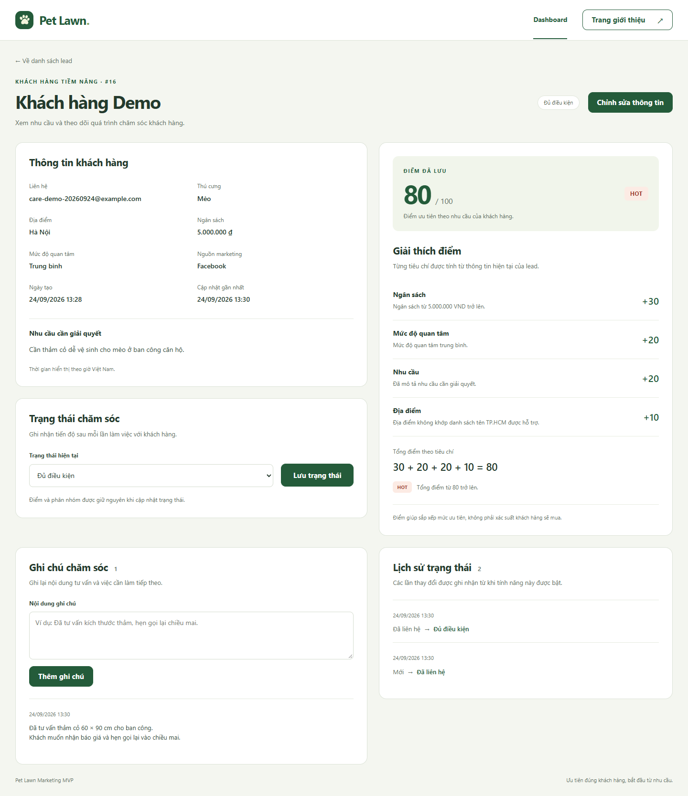
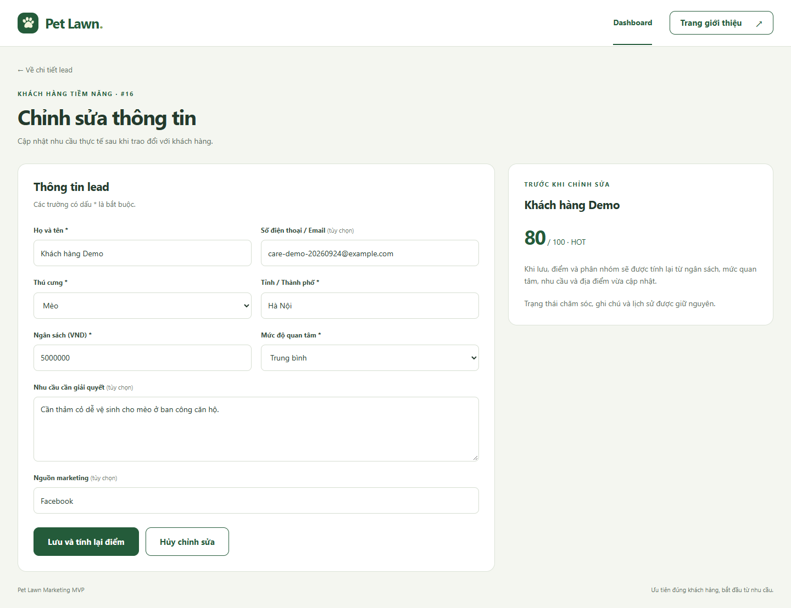
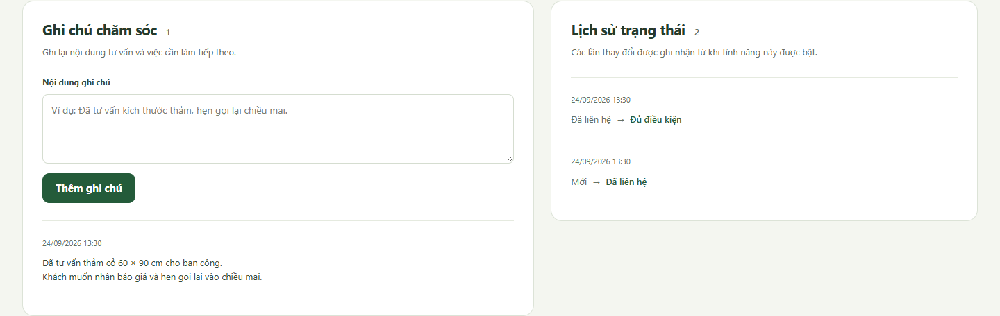

# Pet Lawn Marketing MVP

**Từ khách truy cập đến danh sách khách hàng tiềm năng có thứ tự ưu tiên.**

MVP cho một chiến dịch marketing sản phẩm Pet Lawn — giải pháp thảm cỏ cho
thú cưng tại căn hộ, ban công và sân nhỏ. Khách hàng gửi nhu cầu qua landing
page; hệ thống lưu thông tin, tự chấm điểm theo quy tắc và hiển thị trên dashboard
để đội marketing xác định khách hàng cần liên hệ trước.

**Laravel 12 · PHP 8.4 · MySQL 8.4 · Blade · JavaScript · Vite · Docker Compose**

> Dự án chạy cục bộ bằng Docker, chưa có bản deploy công khai.
> Xem giao diện trong phần ảnh demo bên dưới hoặc làm theo hướng dẫn để chạy thử.

## Ảnh demo

Ảnh chụp từ ứng dụng chạy tại localhost. Thông tin khách hàng trong dashboard
là dữ liệu mẫu; các địa chỉ email dùng miền `example.com`.
Nhấn vào ảnh để xem kích thước đầy đủ.

### 1. Landing page

Giới thiệu sản phẩm, lợi ích và lời kêu gọi nhận tư vấn bằng tiếng Việt.

[](docs/images/landing-page.png)

### 2. Form tiếp nhận khách hàng

Thu thập nhu cầu, ngân sách, địa điểm và mức độ quan tâm. Dữ liệu được kiểm tra
phía server; sau khi lưu thành công, khách hàng nhận thông báo cảm ơn.

[](docs/images/lead-form.png)

### 3. Dashboard marketing

Thống kê toàn bộ lead theo phân nhóm và cả năm trạng thái chăm sóc.
Ảnh chụp có **13 lead: 5 HOT, 7 WARM và 1 COLD**, gồm 10 lead seed và 3 lead
từ các lần demo. Cài mới và seed sẽ có **10 lead: 2 HOT, 7 WARM và 1 COLD**.

[](docs/images/dashboard.png)

### 4. Lọc khách hàng cần ưu tiên

Ví dụ lọc nhóm HOT và sắp xếp theo điểm cao nhất. Danh sách trong ảnh còn 5 lead;
các ô thống kê vẫn thể hiện toàn bộ 13 lead. Khi mở chi tiết rồi quay về,
hệ thống giữ tìm kiếm, bộ lọc, sắp xếp và trang đang xem.

[](docs/images/dashboard-hot.png)

### 5. Chi tiết lead và trạng thái chăm sóc

Bấm vào tên khách hàng trong dashboard để xem nhu cầu, điểm cộng từ từng
tiêu chí và cập nhật trạng thái. Lead demo bên dưới có
**30 + 20 + 20 + 10 = 80 điểm → HOT** sau khi chỉnh ngân sách lên 5 triệu.

[](docs/images/lead-detail.png)

Xem thêm [giao diện chi tiết trên màn hình điện thoại](docs/images/lead-detail-mobile.png).

### 6. Chỉnh sửa thông tin và chấm lại điểm

Cập nhật nhu cầu thực tế sau tư vấn. Nút **Lưu và tính lại điểm** dùng cùng
scoring service; không cho nhập trực tiếp điểm hoặc phân nhóm.

[](docs/images/lead-edit.png)

Xem thêm [form chỉnh sửa trên điện thoại](docs/images/lead-edit-mobile.png).

### 7. Ghi chú và lịch sử chăm sóc

Lưu nội dung tư vấn, việc cần làm tiếp theo và thời điểm đổi trạng thái.
Lịch sử bên dưới ghi nhận **Mới → Đã liên hệ → Đủ điều kiện**.

[](docs/images/lead-care.png)

Ảnh chi tiết, chỉnh sửa và ghi chú dùng một lead demo riêng. Bản ghi này đã được
xóa sau kiểm thử; 13 lead có sẵn được giữ nguyên.

## Chức năng đã hoàn thành

| Chức năng | Hành vi |
| --- | --- |
| Landing page | Giao diện tiếng Việt, responsive, giới thiệu sản phẩm và form tư vấn |
| Lead capture | Validation, CSRF, giữ dữ liệu khi có lỗi, thông báo sau khi lưu |
| Lưu trữ | MySQL, model Lead, migration và 10 bản ghi mẫu |
| Chấm điểm tự động | Tính điểm từ ngân sách, mức quan tâm, nhu cầu và địa điểm |
| Phân nhóm | HOT / WARM / COLD theo ngưỡng điểm rõ ràng |
| Dashboard | Tổng số lead, số lượng từng phân nhóm và cả năm trạng thái; bấm ô trạng thái để lọc |
| Tìm kiếm / lọc | Tên, liên hệ, địa điểm; lọc phân nhóm, trạng thái, nguồn marketing |
| Sắp xếp / phân trang | Mới nhất hoặc điểm cao nhất; 10 lead/trang, giữ bộ lọc |
| Chi tiết lead | Thông tin khách hàng, nhu cầu, thời gian tạo và cập nhật |
| Giải thích điểm | Điểm và lý do cho từng tiêu chí, tổng điểm và lý do phân nhóm |
| Trạng thái chăm sóc | Cập nhật Mới / Đã liên hệ / Đủ điều kiện / Đã chuyển đổi / Không thành công |
| Chỉnh sửa lead | Cập nhật thông tin, validation và tự tính lại score/segment khi lưu |
| Ghi chú chăm sóc | Nội dung tối đa 2.000 ký tự, thời gian ghi nhận, mới nhất trước, phân trang |
| Lịch sử trạng thái | Lưu trạng thái trước/sau và thời điểm; không tạo lịch sử khi lưu lại cùng trạng thái |
| Quay về danh sách | Giữ tìm kiếm, bộ lọc, sắp xếp và trang qua luồng chi tiết/chỉnh sửa/chăm sóc |

Phạm vi hiện tại hoàn thành **bước 1–6 và bốn cải tiến trước bước 7**.
Chưa triển khai bước 7, AI, machine learning,
đăng nhập hoặc REST API.

## Luồng hoạt động

```text
Landing page → Form nhận tư vấn → Validation → LeadScoringService
                                             ↓
                                       Lưu lead vào MySQL
                                             ↓
                                  Dashboard → Tìm kiếm / Lọc
                                             ↓
                                      Chi tiết lead
                                      ├─ Sửa thông tin → Chấm lại điểm → Lưu
                                      ├─ Thêm ghi chú tư vấn
                                      └─ Đổi trạng thái → Ghi lịch sử
```

`LeadController` chỉ nhận dữ liệu đã qua validation. Event `creating` của
model Lead gọi `LeadScoringService` trước khi insert, nên lead mới được lưu
cùng điểm và phân nhóm. Service chỉ tính toán, không ghi database; dashboard
đọc kết quả đã lưu. Công thức không lặp lại trong controller hoặc seeder.

Trang chi tiết dùng `LeadScoringService::explain()` để hiển thị điểm cộng và
lý do từ cùng một phép tính với `calculate()`. Xem trang không ghi database.
Nếu điểm đã lưu khác kết quả tính từ thông tin hiện tại, giao diện nêu rõ
sự khác biệt; không tự ghi đè điểm cũ.

Form trạng thái gửi `PATCH /leads/{lead}/status` kèm CSRF. Backend chỉ nhận
trường `status` đã qua validation, giữ nguyên score, segment và dữ liệu khách.
MVP cho phép chọn trực tiếp một trong năm trạng thái, chưa áp đặt thứ tự chuyển đổi.
Việc cập nhật trạng thái và ghi lịch sử nằm trong một transaction; nếu ghi lịch sử
thất bại thì trạng thái cũng không đổi. Lưu lại cùng trạng thái không tạo lịch sử trùng.

Form sửa gửi `PUT /leads/{lead}`; controller gọi `calculate()` rồi lưu thông tin
cùng điểm mới. Form ghi chú gửi `POST /leads/{lead}/notes`, chỉ thêm ghi chú cho
lead đang xem. Đổi trạng thái và thêm ghi chú không chấm lại điểm.

Bộ lọc được truyền qua tham số `back[...]` đã kiểm tra hợp lệ. Nếu việc sửa lead
làm trang cuối không còn kết quả, hệ thống chuyển về trang hợp lệ cuối cùng
và vẫn giữ các bộ lọc.

## Quy tắc chấm điểm

| Đặc điểm | Điều kiện | Điểm |
| --- | --- | ---: |
| Ngân sách | ≥ 5.000.000 VND / 2.000.000–4.999.999 VND / < 2.000.000 VND | 30 / 20 / 10 |
| Mức quan tâm | high / medium / low | 30 / 20 / 10 |
| Nhu cầu (pain point) | Có nội dung / rỗng | 20 / 0 |
| Địa điểm | Thuộc danh sách TP.HCM / địa điểm khác | 20 / 10 |

Tổng điểm từ **30 đến 100**: **HOT ≥ 80**, **WARM từ 50 đến 79**, **COLD < 50**.
Ví dụ: ngân sách 5 triệu + quan tâm cao + có nhu cầu + HCM
= **30 + 30 + 20 + 20 = 100 → HOT**.

Địa điểm được trim và so sánh không phân biệt hoa thường với `HCM`,
`Ho Chi Minh`, `Ho Chi Minh City`, `TP.HCM`, `TP HCM`, `Thành phố Hồ Chí Minh`.
Chuỗi địa chỉ dài hơn không tự động được suy đoán là TP.HCM.

Rule-based scoring phù hợp giai đoạn MVP vì chưa có dữ liệu chuyển đổi lịch sử,
dễ kiểm thử và giải thích từng tiêu chí. Điểm thể hiện mức ưu tiên theo quy tắc,
chưa phải xác suất mua hàng. Sau này có thể dùng dữ liệu chuyển đổi để đánh giá
và cải tiến phương pháp chấm điểm.

## Công nghệ

| Thành phần | Công nghệ |
| --- | --- |
| Backend | Laravel 12, PHP 8.4 trong Docker; mã nguồn yêu cầu PHP 8.2+ |
| Database | MySQL 8.4, Eloquent ORM và migrations |
| Frontend | Blade, CSS responsive, JavaScript thuần |
| Build assets | Laravel Vite, Node.js và npm |
| Môi trường | Docker Compose: một container app và một container MySQL |
| Kiểm thử | PHPUnit, Laravel Feature Tests; SQLite in-memory cho test |
| Coding style | Laravel Pint |

## Chạy dự án trên máy

### Yêu cầu

- Docker Desktop đang chạy với Linux containers.
- Node.js 22.12+ hoặc 24 và npm.
- Git nếu lấy mã nguồn bằng clone.

PHP, Composer và MySQL chạy trong Docker; không cần AMPPS hoặc PHP trên Windows.

### Cài đặt lần đầu

Mở PowerShell **tại thư mục chứa `compose.yaml` và `artisan`**.

**1. Tạo file môi trường nếu chưa có:**

```powershell
if (!(Test-Path .env)) { Copy-Item .env.example .env }
```

**2. Điền cấu hình database trong `.env`:**

| Biến | Cấu hình |
| --- | --- |
| `DB_CONNECTION` | `mysql` |
| `DB_HOST` | `mysql` — tên service trong Docker Compose |
| `DB_PORT` | `3306` |
| `DB_DATABASE` | Tên database riêng, ví dụ `pet_lawn_marketing` |
| `DB_USERNAME` | Tài khoản ứng dụng riêng, ví dụ `pet_lawn` |
| `DB_PASSWORD` | Tự đặt mật khẩu cho tài khoản ứng dụng |
| `DB_ROOT_PASSWORD` | Tự đặt mật khẩu khác cho tài khoản quản trị MySQL |

Giữ `.env` ở máy của bạn; không commit mật khẩu hoặc `APP_KEY`.
`.env.example` chỉ chứa giá trị mẫu và `.env` đã được loại khỏi Git.

**3. Cài dependencies, khởi động và tạo dữ liệu mẫu:**

```powershell
docker compose build app
docker compose run --rm --no-deps app composer install
docker compose run --rm --no-deps app php artisan key:generate
npm ci
npm run build
docker compose up -d --wait --wait-timeout 90
docker compose exec app php artisan migrate
docker compose exec app php artisan db:seed
```

**4. Mở ứng dụng:**

| Trang | URL trên máy đang chạy Docker |
| --- | --- |
| Landing page và form | [http://localhost:8000](http://localhost:8000) |
| Dashboard | [http://localhost:8000/dashboard](http://localhost:8000/dashboard) |
| Laravel health check | [http://localhost:8000/up](http://localhost:8000/up) |

Đây là địa chỉ local, không phải đường dẫn deploy công khai.

### Chạy lại / dừng dự án

```powershell
docker compose up -d
docker compose down
```

MySQL và dependencies PHP được giữ trong Docker volumes. Khi sửa CSS/JavaScript,
chạy lại `npm run build`. Không cần migrate hoặc seed lại mỗi lần khởi động.

### Cập nhật từ bản đã có bước 6

Hai bảng mới lưu ghi chú và lịch sử. Chạy migration thông thường, giữ dữ liệu hiện có:

```powershell
docker compose up -d
docker compose exec app php artisan migrate
npm run build
```

Không cần seed lại. Lịch sử bắt đầu ghi nhận từ các lần đổi trạng thái sau khi
cập nhật tính năng; không tự tạo lại lịch sử cũ.

## Kịch bản demo nhanh

1. Mở `/dashboard`: nếu chỉ có bộ seed, sẽ có 10 lead mẫu, HOT = 2, WARM = 7, COLD = 1.
   Các lần gửi form trước đó sẽ làm số lượng tăng lên.
2. Lọc `HOT`, tìm `minh.anh@example.com`, sau đó xóa bộ lọc.
3. Mở landing page, bấm **Nhận tư vấn** và điền một lead thử: ngân sách
   **5.000.000 VND**, quan tâm **Cao**, địa điểm **HCM**, nhu cầu có nội dung.
4. Gửi form, xác nhận lời cảm ơn. Điểm và phân nhóm không hiển thị cho khách.
5. Tải lại dashboard: lead mới có **100 điểm / HOT / trạng thái Mới**.
   Nếu bắt đầu từ bộ seed gốc, tổng số lúc này là 11 và HOT = 3.
6. Bấm tên lead mới để xem giải thích **30 + 30 + 20 + 20 = 100 → HOT**.
7. Lọc theo nguồn và chọn sắp xếp điểm cao nhất; mở một lead, thêm ghi chú
   **Đã tư vấn kích thước thảm, hẹn gọi lại chiều mai**.
8. Đổi trạng thái thành **Đã liên hệ**, sau đó **Đủ điều kiện**. Xem hai mục lịch sử,
   rồi lưu lại cùng trạng thái để xác nhận không tạo mục trùng.
9. Bấm **Về danh sách lead**: bộ lọc, sắp xếp và trang vẫn được giữ;
   các ô thống kê trạng thái phản ánh thay đổi.
10. Để minh họa chấm lại điểm, tìm lead seed **Trần Quốc Huy**: ngân sách 450.000,
    quan tâm trung bình, có nhu cầu và địa điểm Hà Nội → **60/WARM**.
    Vào **Chỉnh sửa thông tin**, chỉ đổi ngân sách thành **5.000.000**, bấm
    **Lưu và tính lại điểm** → **30 + 20 + 20 + 10 = 80/HOT**.
    Ví dụ này giả định lead seed chưa được chỉnh sửa trước đó.
11. Thử nhập ngân sách âm hoặc gửi ghi chú trống để xem validation tiếng Việt;
    dữ liệu đã lưu không thay đổi khi form có lỗi.

Seeder nhận diện mẫu bằng email; chạy lại không nhân đôi các bản ghi mẫu còn
giữ nguyên contact và không xóa lead mới. Dùng dữ liệu giả khi demo.

## Kiểm thử

```powershell
docker compose exec app php artisan test
npm run build
```

Kết quả kiểm tra gần nhất: **150 tests đạt / 883 assertions**, Vite build và
Laravel Pint đạt. Test dùng SQLite in-memory, độc lập với MySQL chứa dữ liệu demo.
HTTP của landing page, dashboard và bộ lọc cũng đã được đối chiếu với MySQL thực.

Các nhóm kiểm thử chính:

- Ngưỡng điểm 50/80, biên ngân sách, tên TP.HCM và tính thuần túy của service.
- Schema, defaults, casts, seeding và tự chấm điểm khi tạo lead.
- Form hợp lệ, validation, nullable, HTML escaping và chống ghi đè score/status từ form.
- Thống kê, tìm kiếm, lọc kết hợp, sắp xếp, phân trang và dashboard chỉ đọc dữ liệu.
- Giải thích điểm dùng cùng service; xem chi tiết không thay đổi dữ liệu.
- Cập nhật đủ năm trạng thái, từ chối giá trị không hợp lệ, bỏ qua trường gửi thêm
  và giữ nguyên điểm/thông tin khách hàng. ID không tồn tại trả về 404.
- Chỉnh sửa dùng cùng scoring service, thay đổi WARM → HOT, giữ dữ liệu khi validation lỗi.
- Ghi chú đúng lead, giới hạn độ dài, escape HTML, thứ tự mới nhất và phân trang.
- Lịch sử ghi trạng thái trước/sau, bỏ qua lần lưu trùng và rollback khi ghi lịch sử lỗi.
- Thống kê năm trạng thái, giữ bộ lọc qua các form, độc lập giữa các tab và xử lý trang cuối trống.

Đã thử sửa thông tin, chấm lại điểm, ghi chú và lịch sử qua HTTP với MySQL thực,
kiểm tra CSRF và thông báo validation. Bản ghi QA riêng đã được xóa; đối chiếu
hash xác nhận 13 lead có sẵn không thay đổi. Đã kiểm tra ảnh trang chi tiết và
chỉnh sửa ở kích thước desktop 1440px và điện thoại 390px.

## Cấu trúc mã nguồn chính

```text
app/
├── Http/Controllers/       # Landing page, tiếp nhận lead và dashboard
├── Http/Requests/          # Validation form và bộ lọc
├── Models/                # Lead, LeadNote, LeadStatusHistory
├── Services/LeadScoringService.php
└── Support/DashboardContext.php  # Giữ bộ lọc hợp lệ khi quay lại dashboard
database/
├── migrations/            # Schema database
└── seeders/LeadSeeder.php  # 10 lead mẫu, sử dụng cùng scoring service
resources/
├── views/                 # Landing page, dashboard, chi tiết/chỉnh sửa lead, components
├── css/app.css
└── js/app.js
tests/                     # Unit và Feature tests
docs/                      # Ảnh demo, hướng dẫn kỹ thuật và script chụp ảnh
```

Xem [tài liệu triển khai chi tiết](docs/IMPLEMENTATION.md) để tìm schema,
validation từng trường và cách hoạt động của model event/seeder.

## Phạm vi và giới hạn hiện tại

- Dashboard chưa có đăng nhập; dùng cho demo cục bộ. Cần bảo vệ quyền truy cập
  trước khi triển khai công khai dữ liệu khách hàng.
- Docker đang chạy `php artisan serve` và chỉ mở cổng `127.0.0.1:8000`;
  đây là cấu hình phát triển/demo, chưa phải production.
- Chưa có phân quyền người dùng; lịch sử chưa ghi người thao tác vì chưa có đăng nhập.
- Ghi chú hỗ trợ thêm và xem; chưa có sửa/xóa ghi chú.
- Giao diện có CSS responsive; bảng dashboard cuộn ngang trên màn hình nhỏ.
- Lệnh `php artisan db:table leads --json` hoạt động; bản định dạng bảng cần
  extension PHP `intl` mà image hiện chưa cài.
